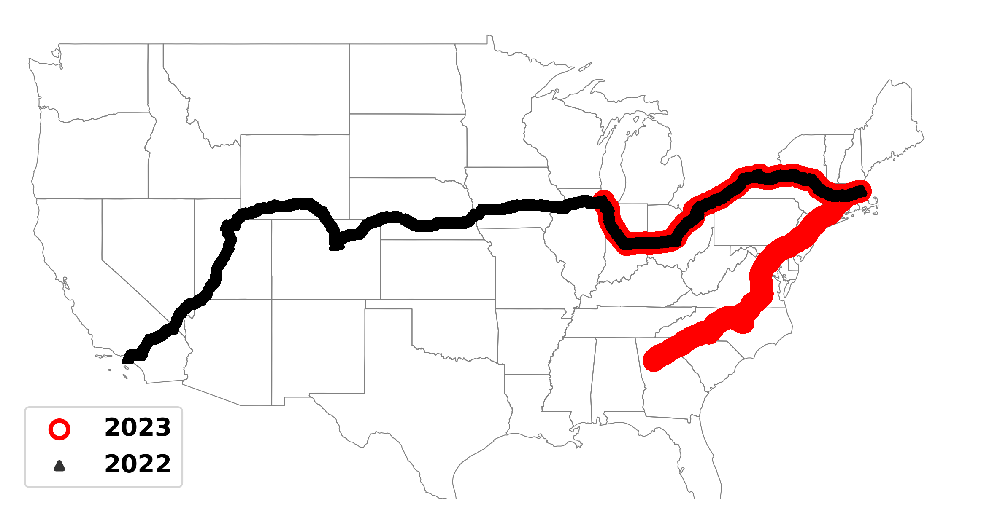

# [PAM 2025] A Large-Scale Study of the Potential of Multi-Carrier Access in the 5G Era
In this repository, we release the dataset and scripts used in the PAM 2025 paper, *A Large-Scale Study of the Potential of Multi-Carrier Access in the 5G Era*.

## Dataset Collection

In the datasets, we release communication data collected in mobile scenarios across three cross-US routes: Drive1 (from Boston to Los Angeles), Drive2 (from Boston to Atlanta), and Drive3 (from Boston to Chicago), focusing on three major operators: T-Mobile, Verizon, and AT&T.  

## Datasets

We have organized the dataset into different sub-folders based on the raw data, processed data, and files prepared for analysis:

| **Data Collection Stage** | **Subfolder**         | **Details**                                                                                      |
| :------------------------- | :-------------------- | :----------------------------------------------------------------------------------------------- |
| Raw Data                  | [raw_files](./datasets/raw_files)       | Unprocessed original files collected from various sources.                                        |
| Processed Data            | [processed_files](./datasets/processed_files) | Files that have undergone basic preprocessing, such as format adjustments or column extraction.   |
| Analysis-Ready Data       | [analysis_ready_files](./datasets/analysis_ready_files) | Files further organized and prepared based on the analysis points outlined in our publication.    |

## Scripts

The scripts folder contains functions and utilities for extracting data from raw datasets and performing various analyses. To streamline their usage, the scripts are categorized into subfolders based on their specific purposes.

| **Folder**          | **Subfolder**         | **Description**                                                                                         |
| :------------------- | :-------------------- | :------------------------------------------------------------------------------------------------------ |
| **process_datasets** | [process_raw](./scripts/process_datasets/process_raw)       | Contains scripts for processing raw data, including separating uplink and downlink data and time alignment. |
| **process_datasets** | [process_processed](./scripts/process_datasets/process_processed)| Includes scripts for further processing datasets, such as calculating throughput differences and handover intervals. |
| **dataset_analysis** | -                     | Contains scripts and tools for advanced analysis and visualization of processed datasets.                 |

## Dataset Description and Usage Instructions
### Raw Dataset
- **Dataset Structure**

    The raw data is divided into two parts based on the data collection method.

    - xcal_raw/
        - drive_trip_1/
            - operators
        - drive_trip_2/
            - operators
        - drive_trip_3/
            - operators
        - start_end_times/
            - uplink_start_end_times
            - downlink_start_end_times
    - ping/
        - ping_data_drive_trip_2/
            - date_of_trip2/
                - operators
        - ping_data_drive_trip_3/
            - date_of_trip3/
                - operators

- **Folder Descriptions**

    1. **XCAL Data**:  
    - XCAL includes data from three drives. The data from Drive 1 has been inherited from the following:  
        https://github.com/NUWiNS/imc2023-cellular-network-performance-on-wheels-data?tab=readme-ov-file#imc-23-performance-of-cellular-networks-on-the-wheels
        The Drive 1 data has undergone preliminary processing as part of the above study.  
    - Data from Drive 2 and Drive 3 require additional processing, including:  
        - Extracting specific KPI columns.  
        - Separating uplink and downlink data based on the start and end GPS times recorded in the `start_end_times` file.

    2. **Ping Data**:  
    - The Ping dataset includes data from Drive 2 and Drive 3.  
    - The timestamps in these files need to be processed to calculate accurate RTT values in real-world time.

- **Usage**

    - For [drive_trip_2](./datasets/raw_files/xcal_raw/drive_trip_2) and [drive_trip_3](./datasets/raw_files/xcal_raw/drive_trip_3):
    - [process_gps_time.py](./scripts/process_datasets/process_raw/process_gps_time.py) --> Converts GPS time into start and end time saved in a `.pkl` file.
    - [separate_ul_dl_gps.py](./scripts/process_datasets/process_raw/separate_ul_dl_gps.py) --> Separates uplink and downlink data based on the recorded start and end times and extracts the relevant data rows.

    - For files in the `ping` dataset:
    - [ping_process_rtt.py](./scripts/process_datasets/process_raw/ping_process_rtt.py) --> Converts the time in the Ping files into the dataset's timestamp format and extracts RTT values for the corresponding timestamps.

### Processed Dataset
- **Dataset Structure**

    - extracted_tput_data/
        - operators
    - extracted_ping_data/
        - rtt/
            - operators
    - tput_data_addho/
        - operators
    - aligned_handover_events/
        - operator_pairs

- **Folder Descriptions**

    1. **Extracted Throughput Data**

    This folder contains data extracted from the original dataset. Relevant columns are selected to analyze throughput and can be further processed for additional analyses. The data serves as a foundational resource for understanding throughput trends and variations.

    2. **Extracted Ping Data**

    This folder stores information extracted from ping files, specifically focusing on RTT (Round-Trip Time) data. The extracted data enables comparative analysis of network latency across different operators, providing insights into performance differences.

    3. **Aligned Handover Events**

    This folder includes processed data derived from Folder 1. Using a specific time tolerance, it aligns the handover events of two operators. The aligned data is used to analyze the time intervals between handover events, illustrating their differences and relationships on a unified timeline.

- **Extracted XCAL Dataset Columns and Their Functions**

    - **TIME_STAMP**: Records the timestamp of each data point, used for temporal analysis.
    - **Lat**: Latitude of the measurement location, providing spatial context for the data.
    - **Lon**: Longitude of the measurement location.
    - **Smart Phone Smart Throughput Mobile Network DL/UL Throughput [Mbps]**: Throughput (in Mbps) measured on the mobile network, essential for performance analysis.
    - **Event 5G-NR/LTE Events**: Indicates detailed signaling and configuration events related to 5G-NR and LTE networks.
    - **5G KPI PCell RF Frequency [MHz]**: The frequency (in MHz) of the primary 5G cell used for communication.
    - **LTE KPI PCell Serving EARFCN(DL/UL)**: The EARFCN (E-UTRA Absolute Radio Frequency Channel Number) of the primary LTE cell, used to identify its frequency.
    - **LTE KPI PCell Serving PCI**: The Physical Cell Identifier (PCI) of the serving LTE cell, which helps distinguish between different cells.
    - **5G KPI PCell RF Serving PCI**: The Physical Cell Identifier (PCI) of the serving 5G cell, used to identify the specific 5G cell in use.

- **Usage**

    - Start with the **Extracted Throughput Data** folder for throughput-related analysis.
        - **For throughput analysis**:
            - [newplot_timestamp.py](./scripts/process_datasets/process_processed/newplot_timestamp.py) --> Divides cellular signals into High Technology (HT) and Low Technology (LT) based on the frequency of the cellular signals in the file. HT represents high-speed 5G (5G-mmWave and 5G-mid band), while LT represents LTE, LTE-A, and 5G-low. Additionally, combines data from the same drive into a single dataframe and calculates the throughput difference between operators at the same timestamps.
            - [conti_time_time_protion.py](./scripts/process_datasets/process_processed/conti_time_time_protion.py) --> Calculates the duration for which Operator A outperforms Operator B at thresholds of 0/10/20/50 Mbps.

        - **For handover data alignment and extraction**:
            - [csv_d4_addho.py](./scripts/process_datasets/process_processed/csv_d4_addho.py) --> Applied to files in the `extract_tput_data` folder to annotate the start and end rows of handover events in the "Event 5G-NR/LTE Events" column. Generates datasets in the `tput_data_addho` folder.
            - [comcsvnew](./scripts/process_datasets/process_processed/comcsvnew.py) --> Applied to datasets in `tput_data_addho` to map handover events of two operators onto the test timeline, allowing observation of the order of handover events. This results in datasets in the `Aligned Handover Events` folder.

    - Use the **Extracted Ping Data for RTT Comparison** folder to evaluate RTT metrics of different operators.
        - [merge_rtt_gps.py](./scripts/process_datasets/process_processed/merge_rtt_gps.py) --> Merges the RTT data with XCAL data based on timestamps, providing RTT data associated with cellular technologies.

    - Leverage the **Aligned Handover Events** folder for studying the intervals of handover events between operators.
        - [timediff_between_ho.py](./scripts/process_datasets/process_processed/timediff_between_ho.py) --> Calculates the time intervals between handover events for two operators (considering only the closest consecutive handover events).

### Analysis-Ready Dataset
- **Dataset Structure**
    - handover_interval_analysis/
        - operator pairs
    - rtt_aligned_tech/
        - operators
    - tput_dominance_duration/
        - operatorpairs_uplink|downlink_threshold
    - throughput_analysis/
        - operator_df_uplink|downlink (drive 1)
        - operator_uplink|downlink_cdf_data (drive 2& drive 3)
        - operatorpairs_diff

- **Folder Descriptions**
    1. **Handover Interval Analysis**  
    This folder contains statistics on the time intervals between the two most recent handovers for different operator pairs. It also includes a `propotion` column, which calculates the weight of each interval relative to the total time.

    2. **RTT Aligned with Technology**  
    This folder includes RTT data for each operator, along with **5G KPI PCell RF Frequency [MHz]** and **LTE KPI PCell Serving EARFCN(DL/UL)**. Subsequent plotting scripts can use the frequency information to determine the cellular technology associated with the RTT.

    3. **Throughput Dominance Duration**  
    This folder contains data on the duration where one operator's throughput exceeds another operator's throughput by thresholds of 0, 10, 20, and 50 Mbps. The `cdf (propotion)` column stores the proportion of each duration relative to the total time.

    4. **Throughput Analysis**  
    This folder includes a dataframe (`operatorpairs_diff.csv`) with the throughput differences between operator pairs at the same timestamps. It also contains XCAL extracted files annotated with the cellular technologies of different operators.

- **Usage**

